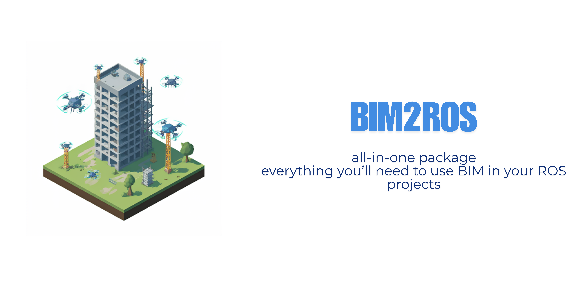

# BIM2ROS

<div align="center">

  <a href="https://github.com/robotics-upo/bim2ros">
    
  </a>

<h3 align="center">Building state supervisor and path finder</h3>
</div>



This repo aims to be one of the steps to integrate Building Information Modeling (or BIM) within ROS.
---

## Table of Contents

1. [Introduction](#introduction)
2. [Features](#features)
3. [Installation](#installation)
4. [Usage](#usage)

---

## Introduction

BIM2ROS is a toolkit that integrates Building Information Modeling (BIM) with the Robot Operating System (ROS), enabling robots to navigate and interact within 3D architectural spaces. It converts BIM data (e.g., from IFC files) into ROS-compatible formats, supporting tasks like path planning and obstacle avoidance in construction, facility management, and smart buildings. BIM2ROS streamlines the use of robotic systems in BIM environments, enhancing efficiency and accuracy in autonomous operations. This repo just contains the code regarding generation of information used in navigation and inspection, to further extend, check this list:
- Pending
- Pending
---

## Features


- **EDF Calculation:** Uses Euclidean Distance Field to represent obstacles and open space.
- **Graph Construction:** Dynamically builds a graph based on obstacle-free paths.


---

## Installation
Just as easy as:
```
pip install -r requirements.txt
```

---

## Usage

1. Drop your IFC file from your BIM project on `Models` folder.
2. Create your own launch file on the `launch` folder. (Be sure to put the correct params for your project to avoid memory overuse).
3. Run:
   ```
   roslaunch bim2ros your_launch.launch
   ```
   It will start creating lots of useful information on the results folder.

## Element Inspection
1. You would need to generate the 3D Grid and Semantic Mapping information, to do so, check `launch/start_generation.launch`. Then:
   ```
   roslaunch bim2ros generation.launch
   ```
   That would start creating all the necessary information.

2. To start any inspection, first of all you would need to have your simulation open with a velodine laser publishing onto `velodine_points`. When you got that ready, launch:
   ```
   roslaunch bim2ros start_detection.launch
   ```

   
## Acknowledgments
This project uses the [IfcOpenShell](https://github.com/IfcOpenShell/IfcOpenShell) library, an open-source tool for working with Industry Foundation Classes (IFC) files.  
Thank you to the IfcOpenShell contributors for their work on this powerful library.
