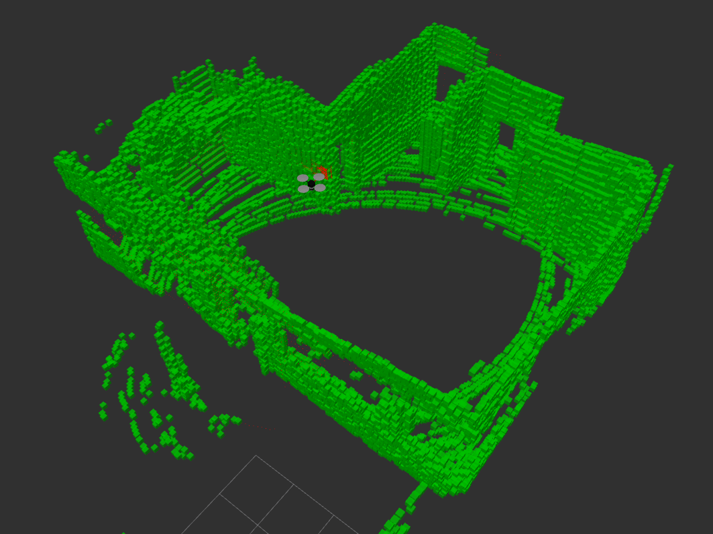
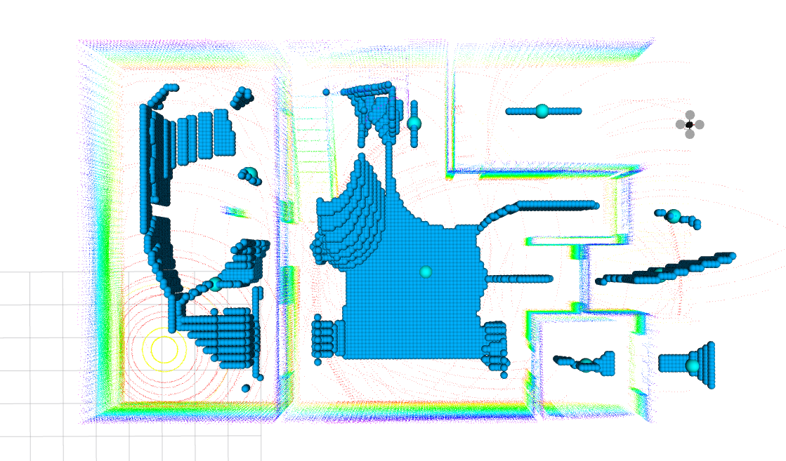
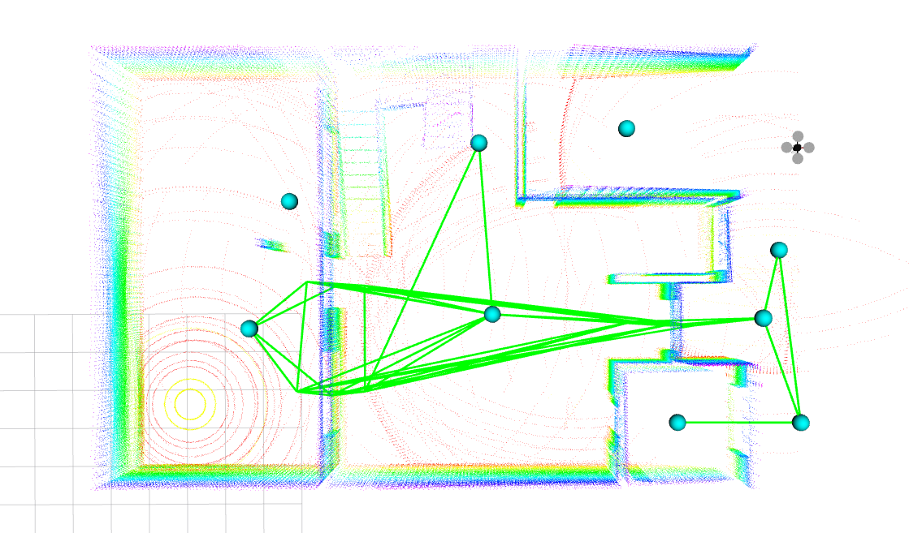

# BIM2ROS

<div align="center">

  <a href="https://github.com/robotics-upo/bim2ros">
    
  </a>

<h3 align="center">Building state supervisor and path finder</h3>
</div>


This repo aims to be one of the steps to integrate Building Information Modeling (or BIM) within ROS.
---

## Table of Contents

1. [Introduction](#introduction)
2. [Features](#features)
3. [Installation](#installation)
4. [Usage](#usage)

---

## Introduction

BIM2ROS is a toolkit that integrates Building Information Modeling (BIM) with the Robot Operating System (ROS), enabling robots to navigate and interact within 3D architectural spaces. It converts BIM data (e.g., from IFC files) into ROS-compatible formats, supporting tasks like path planning and obstacle avoidance in construction, facility management, and smart buildings. BIM2ROS streamlines the use of robotic systems in BIM environments, enhancing efficiency and accuracy in autonomous operations. This repo just contains the code regarding generation of information used in navigation and inspection.
---

## Features


- **EDF Calculation:** Uses Euclidean Distance Field to represent obstacles and open space.
- **Graph Construction:** Dynamically builds a graph based on obstacle-free paths.
- **Element detection:** Know which object are truly present compared to how they should be.
- **Voronoi3D:** Mark zones where distances are big enough to be considered free of obstacles.

---

## Installation
Just as easy as:
```
pip install -r requirements.txt
```

---

## Usage

First of all you will need to drop your IFC file from your BIM project on `Models` folder.

## Element Inspection
1. You would need to generate the 3D Grid and Semantic Mapping information, to do so, check `launch/start_generation.launch` to take an example how params should be established. Then:
   ```
   roslaunch bim2ros your_file_generation.launch
   ```
   That would start creating all the necessary information.

2. To start any inspection, first of all you would need to have your simulation open with a velodine laser publishing onto `velodine_points`. When you got that ready, launch:
   ```
   roslaunch bim2ros start_detection.launch
   ```



## Movement Graph
1. Dispose your gridm generated with [Heuristic Path Planner](<https://github.com/robotics-upo/Heuristic_path_planners>)] in `grids` folder within the repo. Then:
   ```
   roslaunch bim2ros load_gridm.launch
   ```
  This will load the EDF and generate a Voronoi 3D approximation of the space. This will be published on a topic called `/voro_markers`
2. You will need to launch 
   ```
   roslaunch bim2ros clusters.launch
   ```
  This will show which points of the Voronoi are going to be visited in `/cluster_medoids` . Adjusting the paramaters will make you be able to have more density in points if you want, but affecting on performance.



  Then, you can run:
   ```
   roslaunch bim2ros kdtree_clusters.launch
   ```
  This will show you which points are reachable from one to other. Remember to adjust the parameters depending on how restrictive you want the connections to be made.
  You would be able to see a topic called `/global_graph` publishing the full global traversability graph



3. To see the final path to follow, run:
   ```
   roslaunch bim2ros MST.launch
   ```
   If you wanna see those connections on text format, they will be saved as `mst_edges.txt`


   
## Acknowledgments
This project uses the [IfcOpenShell](https://github.com/IfcOpenShell/IfcOpenShell) library, an open-source tool for working with Industry Foundation Classes (IFC) files.  
Thank you to the IfcOpenShell contributors for their work on this powerful library.
